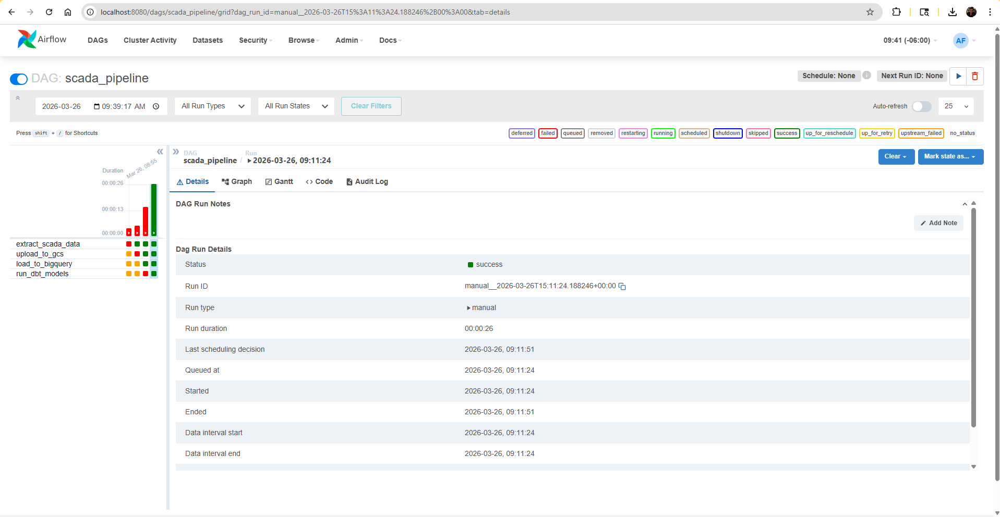
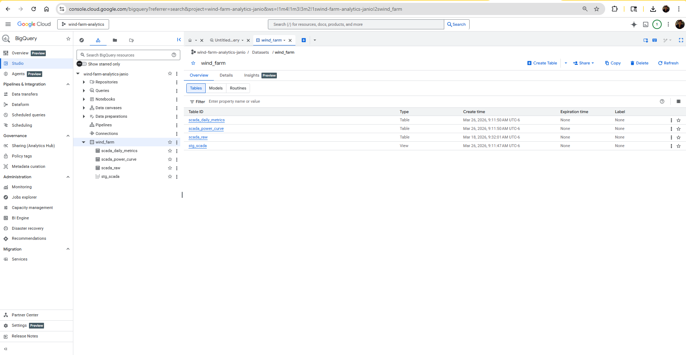
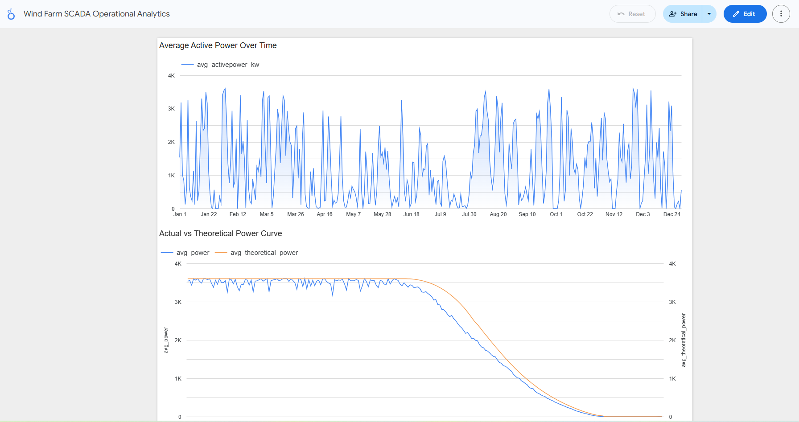

# Wind Farm SCADA Data Pipeline with GCP, dbt, Terraform, and Airflow

## Project Overview

Wind turbines generate large volumes of time-series SCADA data that must be efficiently ingested, processed, and analyzed to monitor performance and identify inefficiencies.

This project builds an end-to-end data engineering pipeline that ingests wind turbine SCADA data, stores it in a cloud data lake, transforms it into analytical models, and visualizes key operational metrics.

---

## Architecture

The pipeline follows a modern data engineering architecture:

- Data Ingestion: Python script downloads and processes SCADA data  
- Data Lake: Google Cloud Storage (GCS)  
- Data Warehouse: BigQuery  
- Transformations: dbt  
- Infrastructure as Code: Terraform  
- Orchestration: Apache Airflow (Dockerized)  
- Visualization: Looker Studio  

---

## Technologies Used

- Google Cloud Platform (GCP)
  - Cloud Storage
  - BigQuery
- Terraform  
- dbt (BigQuery adapter)  
- Apache Airflow (Docker)  
- Python (pandas, kagglehub)  
- Docker & Docker Compose  
- Looker Studio  

---

## Pipeline Description

### 1. Data Ingestion
- Dataset sourced from Kaggle (wind turbine SCADA data)  
- Python script:
  - Downloads dataset  
  - Cleans column names  
  - Saves as CSV  

### 2. Data Lake (GCS)
- CSV file uploaded to GCS bucket:

```
gs://<bucket>/raw/scada_data.csv
```

### 3. Data Warehouse (BigQuery)
- Raw data loaded into:
  - `scada_raw`  
- Cleaned and structured into:
  - `scada_stg`  

### 4. Transformations (dbt)

dbt models create analytical datasets:

- **stg_scada**  
  Cleaned and standardized data  

- **scada_daily_metrics**  
  Daily aggregates:
  - average power  
  - average wind speed  
  - theoretical power  
  - record counts  

- **scada_power_curve**  
  Wind speed bucket vs:
  - actual power  
  - theoretical power  

### 5. Orchestration (Airflow)

An Airflow DAG orchestrates the full pipeline:

1. Extract SCADA data  
2. Upload to GCS  
3. Load into BigQuery  
4. Run dbt models  

The pipeline runs end-to-end automatically.

---

## Dashboard

A Looker Studio dashboard provides key insights:

### Key Visualizations

- Average Active Power Over Time  
- Actual vs Theoretical Power Curve  
- Wind Speed Trends  

Dashboard Link:  
https://lookerstudio.google.com/reporting/dcde4934-3e63-4f6d-96bd-a547d0fac973

---

## How to Run

### Prerequisites

- Docker & Docker Compose  
- GCP account  
- Terraform  
- dbt  

### 1. Clone the repository

```bash
git clone https://github.com/janiomjunior/wind-farm-analytics.git
cd wind-farm-analytics
```

### 2. Infrastructure (Terraform)

```bash
cd terraform
terraform init
terraform apply
```

### 3. Start Airflow

```bash
cd ../airflow
docker compose up -d
```

Access Airflow UI:  
http://localhost:8080

### 4. Run the Pipeline

Trigger DAG:
```
scada_pipeline
```

---

## Screenshots

### Airflow DAG


### BigQuery Tables


### Dashboard


---

## Lessons Learned

- Managing permissions between Docker containers and mounted volumes is critical  
- GCP authentication inside containers requires careful configuration  
- dbt simplifies transformation logic and improves maintainability  
- Airflow enables reproducible and automated pipelines  

---

## Future Improvements

- Add streaming ingestion (Kafka / PubSub)  
- Implement anomaly detection  
- Partition BigQuery tables  
- Add CI/CD pipeline  

---

## Project Structure

```
wind-farm-analytics/
├── ingestion/
├── data/
├── dbt/
├── terraform/
├── airflow/
├── images/
└── README.md
```

---

## Author

Janio Mendonca Jr
